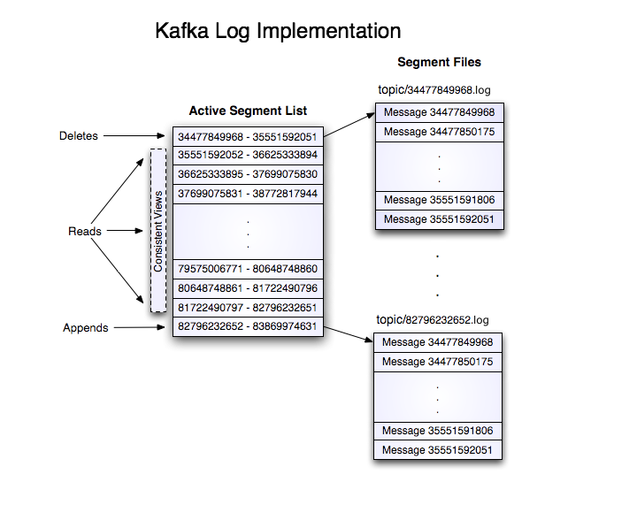

# Kafka Lite design notes

## Functional requirements
- distributed commit log 
- streaming with grpc clients
- one point data consumption from grpc
- data ordered by topics

## Non functional requirements
- reliable
- scalable

Notes : 
things that leads to inefficiency
- small i/o
- excessive byte coping (using proto, and shared them)
- how do we handle messages delivery semantics

Lot of configuration
- producer acknowledgment
- messages delivery semantics

High level structure:

* topics

* partitions

* replicas

* a bunch of files (the log)

