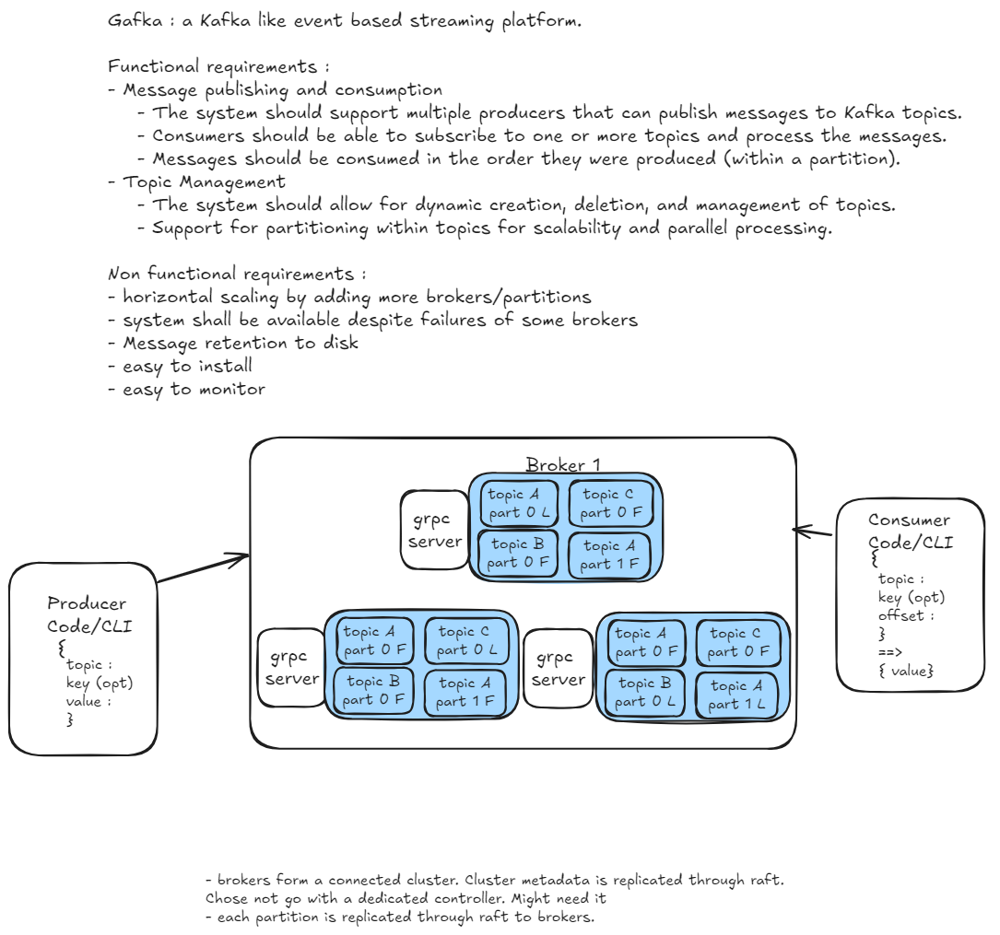

# Kafka Lite design notes

## Functional requirements
- distributed commit log 
- streaming with grpc clients
- one point data consumption from grpc
- data can be ordered by topics and consumer shall consume data in the order sent by the producer

## Non functional requirements
- reliable
- scalable

Notes : 
things that leads to inefficiency
- small i/o
- excessive byte coping (using proto, and shared them)
- how do we handle messages delivery semantics

Lot of configuration
- producer acknowledgment
- messages delivery semantics

## HLD

Gafka is a list of brokers that handles produce and consumers requests.
Gafka is a CP (consistent paritition system). Consistency is favored.
partitions replicated through raft and brokers metadata are also replicated through raft.
An inconvenient is that the two layers of raft add a lot of network latency and disk write-off.
I think it is acceptable for v1. For v2, it might be necessary to use another type of replication(ISR + f+1 replicas) (see https://kafka.apache.org/documentation/#design_replicatedlog)
consistent hashing is used to distribute partition distribution

High level structure:

## Internals

###
Log is a append log file. Each log consists of multiple segments and one activate segment.
Each segment is a store and an index to spead up access.

### Partition
A partition is a higher level construct that handles a replicated Log. Partitions are replicated using raft depending on the replication factor.
The partition offers a configurable read consistency level.

### Topics

### Broker

### Partition distributions in the cluster and leader election

### GRPC server / Protobuf

### CLI producers and  consumers
topic is a logical grouping for client messages.
each topic is split in partitions(specified by the client).
Each partition is a log, and is replicated by the replication factor.

# Resources 
- https://github.com/rqlite/rqlite/tree/master
- Book Building Distributed Services in Go